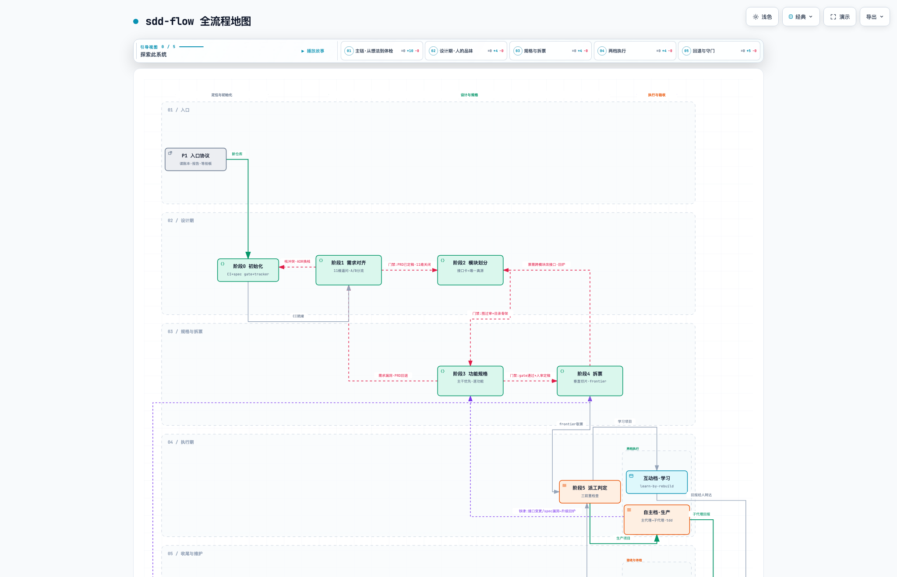
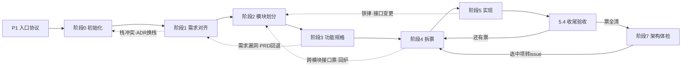
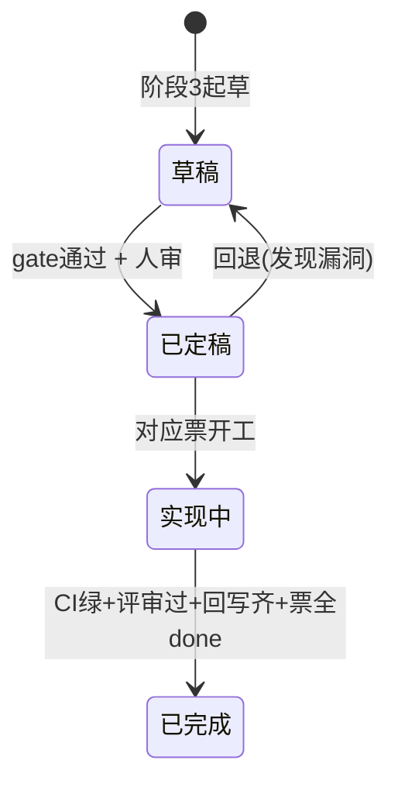

<div align="center">

# sdd-flow

**一套跑在 AI 编程助手里的 SDD 全流程手册**

*从一句粗糙的 PRD,到可运行、有账本、有门禁的交付。*

[](LICENSE)


</div>

---

## 这一切的前提：一个倒转

传统开发，**代码里包含一切**——需求活在注释里、架构活在结构里、行为活在测试里，文档永远是事后补的、过时的。

AI 时代倒过来了：**文档里包含一切，AI 做的只是把文档翻译成代码。**

这个倒转要成立，有三件事必须被解决，sdd-flow 就是围绕它们搭的：

| 问题 | sdd-flow 的回答 |
|---|---|
| 文档会不会撒谎、会腐烂？ | **spec gate**：一个 200 行的校验脚本进 CI,机器核对账本(依赖无环、验收绑测试、已完成→测试必须存在) |
| AI 乱来怎么办？ | **门禁链**：PRD 定稿、架构图过审、spec 定稿、收尾对账——四道闸,不过闸不前进 |
| 上下文炸了怎么办？ | **产物即状态**：进度不存聊天记录,全存磁盘文件;新窗口靠读账本零记忆恢复 |

三条设计原则,写进了 SKILL.md 的"五条核心原则",不可妥协：

> 1. **接口先行**——先定模块边界和接口,人拍板,实现委托给 AI
> 2. **测试锁行为**——测试写在 seam 处,测试通过 = 模块完成
> 3. **产物即状态**——新窗口通过读产物恢复上下文,不靠聊天记录

## 全流程地图



> 上图是静态截图。[docs/process-map.html](docs/process-map.html) 是可交互版本(暗/亮主题、缩放、搜索、5 个聚焦视图),下载后本地打开即可。



**虚线是回退边。** 回退到哪个阶段,那个阶段的产物状态同步退回——状态机不允许跳线。

## 八个阶段

| 阶段 | 做什么 | 关键产物 | 门禁(不过不前进) | 人做什么 | AI 做什么 |
|---|---|---|---|---|---|
| **0 初始化** | 守门员先站好 | CI + spec gate + tracker + AGENTS.md | CI 先于第一行业务代码 | 宣布技术栈、开分支保护 | 实例化 CI、复制校验脚本 |
| **1 需求对齐** | 把粗糙 PRD 逼问清楚 | `docs/prd.md`(带状态机)+ `CONTEXT.md` | 11 维覆盖清单逐维关闭、无 `[待确认]` | 回答 B 类问题(选择题+改错题) | 按 11 维逼问、A 类自动补全、决策当场落盘 |
| **2 模块划分** | 深模块 + 架构图 | `specs/modules.md`(接口卡)+ 架构图 + 过审 ADR | **架构图过审**,没过审不许编码 | 拍板模块边界、逐节点过图 | 聚类、起草接口卡、画图、导游式讲解 |
| **3 功能规格** | 每功能一份可验收 spec | `specs/<功能名>.md` | spec gate 通过 **+ 人审定稿** | 审接口定义、"不做什么" | 起草、跑 gate、自己修到 PASS |
| **4 拆票** | 垂直切片 | tracker 上的票(带 `Touches modules`) | 没有跨模块改接口的票 | 拍板粒度和依赖边 | 切片、quiz、发布 |
| **5 实现** | 逐票循环写代码 | 代码 + seam 测试 + lessons | CI 绿 + code-review + 收尾回写 | 互动档把控 / 自主档旁观 | TDD 循环到绿(见下) |
| **6 CI 守门** | 横切维护 | `.github/workflows/ci.yml` 更新 | — | 确认分支保护 | 同步边界规则 |
| **7 架构体检** | 定期扫代码腐烂 | 候选清单 → 转 issue | — | **拍板**做哪个 | 扫浅模块/重复实现/无测试 seam |

## 两档执行：学习和生产是两回事

阶段 5 按项目性质分档,这是本流程最重要的分叉:

| | 互动档(学习项目) | 自主档(生产项目) |
|---|---|---|
| 谁把控 | **人**,每阶段确认 | 主代理派**子代理**,全自动 |
| 节奏 | `learn-by-rebuild`:小步 ≤30 行、讲解落盘、你说"下一步"才推进 | 子代理自驱 TDD 循环到 CI 绿,中途不打扰 |
| 调度 | 人开新窗口,交接包衔接 | 主代理逐张派发,**默认不并行** |
| 共同点 | 测试先行、写在 seam 处;CI 绿才算完;收尾回写四样 | 同左 |

## 三个状态机驱动一切

产物的状态就是流程的进度。翻转时机和执行者写在状态流转表里,**不许事后补账**:



- **PRD**:粗稿 → 逼问中 → 已定稿(gate 校验:标定稿仍含 `[待确认]` → FAIL)
- **spec**:草稿 → 已定稿 → 实现中 → 已完成(gate 校验:已完成 → 绑定的测试必须真实存在)
- **票**:ready-for-agent → done(验收框全勾、L0 核对后置位)

## 机器守门：spec gate

[references/spec-validator.py](references/spec-validator.py) —— 零依赖、纯标准库、`python3 tools/check_specs.py` 直接跑,复制进目标仓库由 CI 调用:

- `specs/modules.md`:模块依赖**无环**、依赖指向已声明模块(抓拼写错误)
- 功能 spec:状态取值合法、触及的模块 ⊆ 花名册、每条验收标准绑定测试标识
- **状态 `已完成` → 测试必须能在源码中找到**(防"谎报完工")
- PRD:标 `已定稿` 但仍有 `[待确认]` → FAIL
- `.scratch/` 本地票:触及模块必须已声明;spec 已完成但票未 done → 警告

> 校验脚本自带 **23 个分支的自测夹具**(全绿),覆盖成环、漏卡、谎报完成、三种测试标识写法等。规格契约见 [module-spec-format.md](references/module-spec-format.md)「机器可校验约定」。

## 需求逼问:11 维覆盖清单

业务是逼问出来的,但开放式逼问靠运气。[requirement-checklist.md](references/requirement-checklist.md) 给逼问装上防漏清单:

- **11 个维度逐维关闭**(边界/对象/功能规则/联动/流程审批/查询报表/权限/集成/异常边界/非功能/数据生命周期),标 `适用` 或 `N/A+理由`,沉默跳过 = 没问
- **A/B 分流**:行业通用的 `[AI自动补全]`(不耗用户脑力),企业专属的 `[待确认]`(必须带建议提问)
- **固定提问格式**:问题 N + AI 建议 + 理由 + 其他选项 + 快捷回复
- **硬门禁**:PRD 存在 `[待确认]` → 不得定稿

## 安装

```bash
# 1. 安装底层技能生态(mattpocock 系)
npx skills@latest add mattpocock/skills

# 2. 安装本 skill
git clone https://github.com/zzwcoding/sdd-flow.git ~/.claude/skills/sdd-flow
# (ZCode 用户:cp -r sdd-flow ~/.agents/skills/)

# 3. 在目标仓库跑一次阶段 0
#    对 AI 说:「用 sdd-flow 从 PRD 开始规划」或「按流程开发新功能」
```

**触发词**:按流程开发新功能 / 从 PRD 开始规划 / 继续按文档实施任务 / 搭 CI / sdd-flow

### 依赖的底层技能

本 skill 是编排层(路由 + 产物契约),纪律由底层技能承担:

| 技能 | 来源 | 用在哪 |
|---|---|---|
| grill-with-docs / grilling / tdd / code-review / to-spec / to-tickets / wayfinder / codebase-design / setup-matt-pocock-skills | [mattpocock/skills](https://github.com/mattpocock/skills) | 阶段 1-5 的逼问、TDD、评审、合成、拆票、决策地图 |
| learn-by-rebuild | 本作者另一技能 | 互动档(学习项目)的教学纪律 |
| archify / improve-codebase-architecture | 本作者另一技能 | 阶段 2 架构图、阶段 7 体检 |

## 目录结构

```
sdd-flow/
├── SKILL.md                      # 入口:五原则 + 窗口分层 + 阶段路由 + 状态流转表 + 失败处理
├── references/
│   ├── requirement-checklist.md  # 需求逼问 11 维覆盖清单(阶段 1 必读)
│   ├── deep-modules.md           # 深模块划分准则(阶段 2 必读)
│   ├── module-spec-format.md     # 功能 spec 与模块接口卡模板(阶段 3 必读)
│   ├── guided-review.md          # 导览式验收:带用户逐节点过架构图(阶段 2 必读)
│   ├── ci-template.md            # CI 流水线骨架(阶段 6 必读)
│   ├── repo-layout.md            # 仓库目录约定
│   └── spec-validator.py         # spec gate 校验脚本(复制到仓库 tools/)
└── docs/
    ├── process-map.html          # 可交互全流程地图(下载后本地打开)
    ├── process-map.json          # 地图源规格
    └── process-map-preview.png   # 地图截图
```

## 值得一提的设计取舍

- **为什么没有技术底座?** 固定技术栈 = 固定品类。sdd-flow 刻意栈无关、品类无关:方法论的魂(规格先行、人工门禁、可追溯、代码生成)完全跨品类,变的只是"规格长什么形状"。
- **为什么默认不并行?** 多个自主子代理同时回写账本会踩脚。回写由主代理串行执行;要并行需用户明确开口。
- **为什么没有变更提案(diff proposal)?** spec 直接全局更新——"怎么变的"由 git 兜底,重大决策另有 ADR。spec 永远只写"现在是什么"。
- **为什么架构图不是真源?** `specs/modules.md` 是唯一真源,图是它的投影。阶段 2 内卡一变重出图;编码期以卡为准,体检时图一次算总账。
- **为什么入口协议要"停下等拍板"?** 新窗口的定位是判断,判断错了后面全错——这一下确认是全流程最便宜的错误保险。

## English

**sdd-flow** is an agent skill that runs a full Spec-Driven Development pipeline inside AI coding assistants: a rough PRD gets interrogated into a precise requirement doc (11-dimension coverage checklist with A/B question triage), architecture gets carved into deep modules with a human-approved interactive diagram, every feature gets a machine-validated spec (acceptance criteria bound to test names), work is split into dependency-ordered tickets, and implementation runs in two modes — *interactive* (human-paced, learn-by-rebuild) or *autonomous* (orchestrator dispatching subagents, strict TDD until CI is green). A 200-line zero-dependency validator wired into CI enforces the ledger: acyclic module deps, acceptance criteria bound to tests, and no spec may claim "done" without its tests actually existing in the source. Progress lives in on-disk artifacts, never in chat history — any fresh context window can resume from the ledger alone.

## License

[MIT](LICENSE) © 2026 Buster Coxen (zzwcoding)
